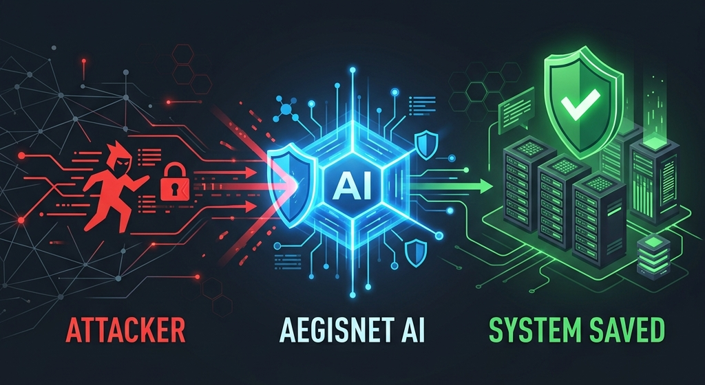
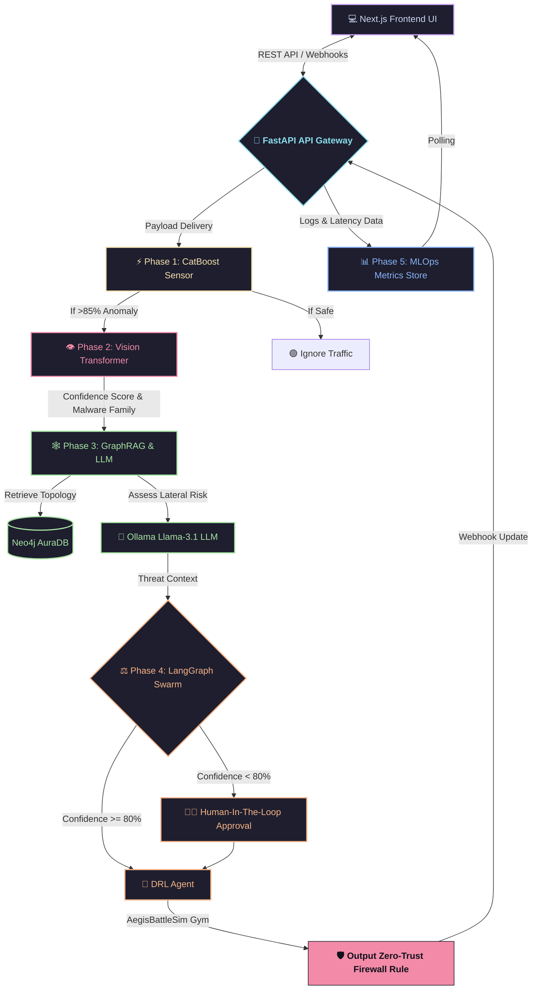

<div align="center">
  
  <br/><br/>
  
  
  
  
  
  
  <h1>🛡️ AegisNet: Autonomous Agentic Cyber Defense</h1>
  <p><b>An end-to-end, multi-modal cybersecurity orchestration system built with Machine Learning, Vision Transformers, GraphRAG, Deep Reinforcement Learning, and Local LLMs.</b></p>
</div>

<br/>

> **AegisNet** represents the next generation of autonomous network defense. Traditional cybersecurity relies on static rules (YARA signatures, IP blacklists) which fail against zero-day exploits. AegisNet solves this by treating cybersecurity as a **multi-modal AI problem**.

It acts as an autonomous AI Security Operations Center (SOC) that can "feel" network anomalies via gradient boosting, "see" the visual texture of malware binaries, map blast radiuses using Spatial GraphRAG, generate human-readable threat assessments using local Llama 3.1 LLMs, and deploy zero-trust isolation firewalls via Deep Reinforcement Learning.

---

## 🏗️ Master Architecture Flow



---

## 🚀 The 5 Phases of Defense

### 1️⃣ Phase 1: Ingestion & Triaging (The Senses)
The frontline tripwire. High-speed packet parsing using **Polars** drops irrelevant features to prevent the AI from overfitting. The sanitized data is fed into a highly optimized **CatBoost** Gradient Boosting model trained to detect the statistical signatures of 15 different malware families.
* **Tech Stack**: `FastAPI`, `Polars`, `CatBoost`

### 2️⃣ Phase 2: Multi-Modal Vision Triage (The Analyst)
Traditional signature matching fails when hackers slightly modify their code. AegisNet bypasses this by converting raw binary code into 2D Grayscale Images. A massive **PyTorch Vision Transformer (ViT)** then "looks" at the image to identify the malware based on its visual texture, achieving extremely high accuracy against zero-day mutations.
* **Tech Stack**: `PyTorch`, `Transformers (ViT)`, `FastAPI`, `Pillow`

### 3️⃣ Phase 3: Spatial GraphRAG & Local LLM (The Brain)
Detecting malware isn't enough; the system must understand the blast radius. Phase 3 maps the corporate network topology into a **Neo4j AuraDB** graph database. The system then passes the retrieved graph context to a completely local **Ollama (`llama3.1:8b`)** Large Language Model to dynamically generate an enterprise-grade threat summary and lateral movement risk assessment.
* **Tech Stack**: `Neo4j Aura`, `Cypher`, `LangChain`, `Ollama`

### 4️⃣ Phase 4: Native Active Defense & SOAR (The Shield)
The central intelligence. A **LangGraph** State Machine orchestrates the pipeline. It evaluates the AI confidence against a strict Human-In-The-Loop (HITL) matrix. If approved, it passes the state to a Deep Reinforcement Learning (PPO) agent inside a native **AegisBattleSim** Gymnasium environment. The agent calculates the optimal firewall isolation strategy, and generates a structured JSON SOAR webhook mimicking an enterprise push to Splunk or Elastic Security.
* **Tech Stack**: `LangGraph`, `Stable-Baselines3 (PPO)`, `Gymnasium`, `PyTest`

### 5️⃣ Phase 5: MLOps Dashboard (The Overwatch)
A stunning **Next.js** interactive dashboard that fully decouples the frontend from the backend. Features a real-time `React Flow` network canvas showing live infection spread and isolation, alongside a massive MLOps telemetry suite tracking Vision Model Confidence, Data Drift (Wasserstein Distance), and Phase Inference Latency via `Recharts`.
* **Tech Stack**: `Next.js`, `React Flow`, `Tailwind CSS`, `Recharts`

---

## ⚙️ Setup & Installation (Local Execution)

AegisNet has been engineered to run **100% locally** on a Windows/Linux machine without requiring Docker containers, leveraging native Python environments.

### Prerequisites
* Python 3.10+
* Node.js & npm
* [Ollama](https://ollama.com/) (installed with `llama3.1:8b` model pulled)
* A free [Neo4j AuraDB](https://neo4j.com/cloud/aura/) account.

### 1. Configure Graph Database
Navigate to `backend/phase3_graph` and create a `.env` file with your live Neo4j credentials:
```env
NEO4J_URI=neo4j+s://<YOUR_INSTANCE>.databases.neo4j.io
NEO4J_USERNAME=neo4j
NEO4J_PASSWORD=your_secure_password
```

### 2. Backend Setup
Initialize the Python environment and start the FastAPI Gateway. This gateway centrally manages all 5 phases.
```bash
cd backend
python -m venv venv
.\venv\Scripts\Activate.ps1
pip install -r requirements.txt
python -m uvicorn api_gateway.main:app --reload --port 8000
```

### 3. Frontend Setup
In a separate terminal, install the UI dependencies and start the Next.js server.
```bash
cd frontend
npm install
npm run dev
```

---

## 🎮 Running the Simulation

1. Open your browser to `http://localhost:3000`.
2. Ensure **Ollama** is running in the background.
3. Select an attack vector from the Control Panel and click the **"Launch Attack"** button.
4. Watch the terminal output in the UI as the LangGraph State Machine triggers the CatBoost model, the Vision Transformer, the Neo4j query, the Llama-3 summary, and the DRL firewall isolation.
5. If the AI is uncertain, a gorgeous **Human-In-The-Loop (HITL)** modal will pop up demanding your approval.
6. Once contained, an **After-Action Report** overlay will slide in detailing exactly what happened.
7. Switch to the **MLOps Tab** to view the live Recharts telemetry, latency profiling, and data drift tracking.

---

> **Note:** To audit the LangGraph state machine and verify the RL agent's False Positive protections, run the native PyTest suite: `pytest backend/tests/test_swarm.py -v`.
