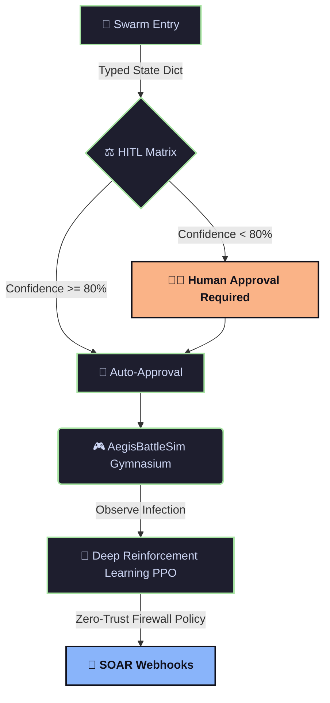

<div align="center">
  
  
  
  <h2>🛡️ Phase 4: Active Defense Simulation & SOAR</h2>
</div>

> **The Central Intelligence.** Phase 4 orchestrates the entire lifecycle of a threat, from detection (Phase 1/2) to assessment (Phase 3) to final containment (Phase 4).

## 🌊 Pipeline Flow



## ⚙️ How It Works

1. 🧭 **LangGraph State Machine**: A typed state dictionary flows seamlessly through the nodes.
2. ⚖️ **HITL Matrix**: A Human-In-The-Loop fallback mechanism checks the Vision model's confidence. If confidence is `>=80%`, it auto-approves containment; otherwise, it pings the SOC.
3. 🎮 **AegisBattleSim (Gymnasium)**: Instead of relying on buggy external dependencies, AegisNet uses a **Native Python Gymnasium Environment** to mathematically model lateral infection spread.
4. 🧠 **Deep Reinforcement Learning**: A pre-trained `PPO` (Proximal Policy Optimization) agent dynamically observes which server is infected and outputs the optimal Zero-Trust Firewall isolation rule.
5. 🔗 **SOAR Webhooks**: Upon containment, the system generates a structured JSON webhook formatted for enterprise SIEMs like Splunk or Elastic Security.

## 🧪 Testing Locally

Run the full Swarm (make sure Phase 1 and Phase 2 servers are running, or rely on the mock triggers):
```bash
python swarm.py
```
To run the State Machine Audit tests:
```bash
pytest ../tests/test_swarm.py -v
```
